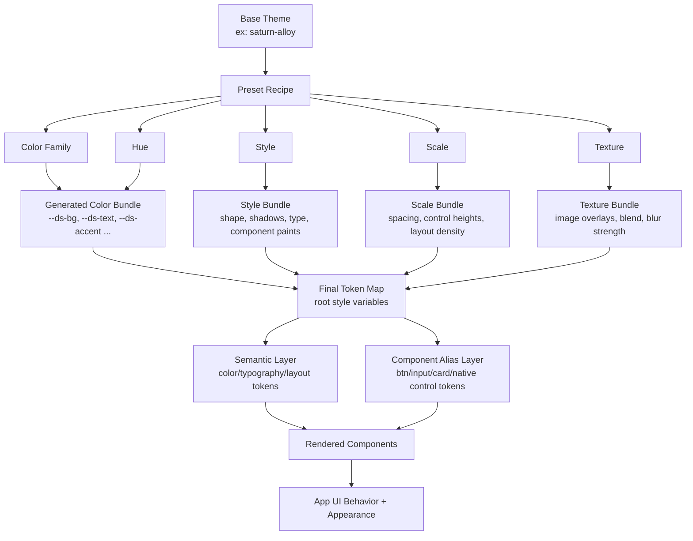
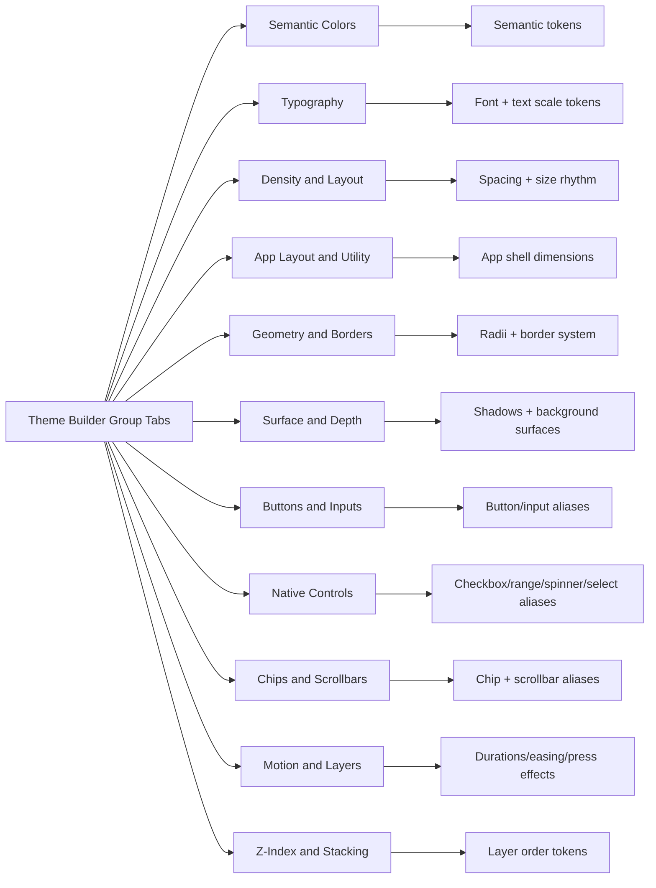

# Theme Architecture Diagram

This page shows how a base theme resolves into presets, properties, and final component behavior.

## Layer Model

## Property Group Breakdown

## Resolution Order Used by Studio

1. Clear any prior inline overrides.
2. Build color bundle from `Color Family + Hue`.
3. Apply `Style` bundle.
4. Apply `Scale` bundle.
5. Apply `Texture` bundle.
6. Sync builder controls from computed final values.

That order means later preset groups can intentionally override earlier values.